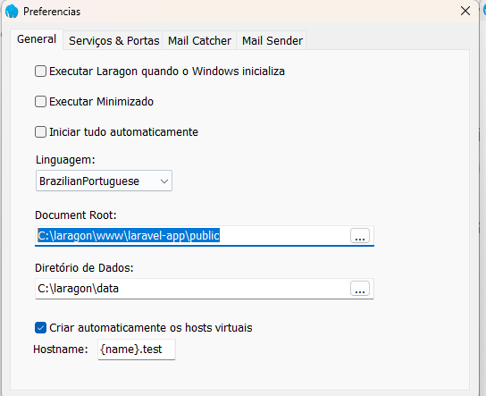

# **API**

## Como Rodar a API

Para rodar a API é necessário ter um ambiente com o MySQL e um Servidor HTTP. Você pode seguir o passo a passo abaixo. 

### Instalação do Laragon

Acesse o site do [Laragon](https://laragon.org/download/) e baixe a versão completa "Download Laragon - Full". Siga as instruções de instalação.

Em Seguida clique com o botão direito sobre o botão iniciar e clique em "Preferencias...".


No campo "Document Root:" coloque o diretório completo da pasta public do projeto.



Saia das "Preferencias...".

Para configurar o projeto copie o arquivo ".env.example" para o arquivo ".env" e adicione o usuário e a senha para acessar a API externa fornecida para realizar esse teste. Altere o valor das variáveis abaixo:

```
    SERVICES_API_USERNAME=""
    SERVICES_API_PASSWORD=""
``` 

Volte ao Menu do Laragon e inicie o projeto na tela inicial no botão "Iniciar Tudo".


### Criando e Populando o Banco de Dados

Após iniciar o Laragon o banco de dados estará funcionando na porta 3306, caso necessário altere a porta no arquivo de configuração ".env" do projeto e nas "Preferencias..." do Laragon.

Clique no botão "Banco de Dados" no Menu inicial.


E em seguida crie uma conexão do banco de dados


Clique no botão "Terminal" no Menu inicial.

Caso necessário volte para a pasta principal do projeto com o comando:

` cd ..`

Rote o comando para criar as Migrates e aceite criar o banco de dados:

`php artisan migrate`

E Em seguida para popular as tabelas:

`php artisan db:seed`

A imagem abaixo ilustra a execução dos comando:


